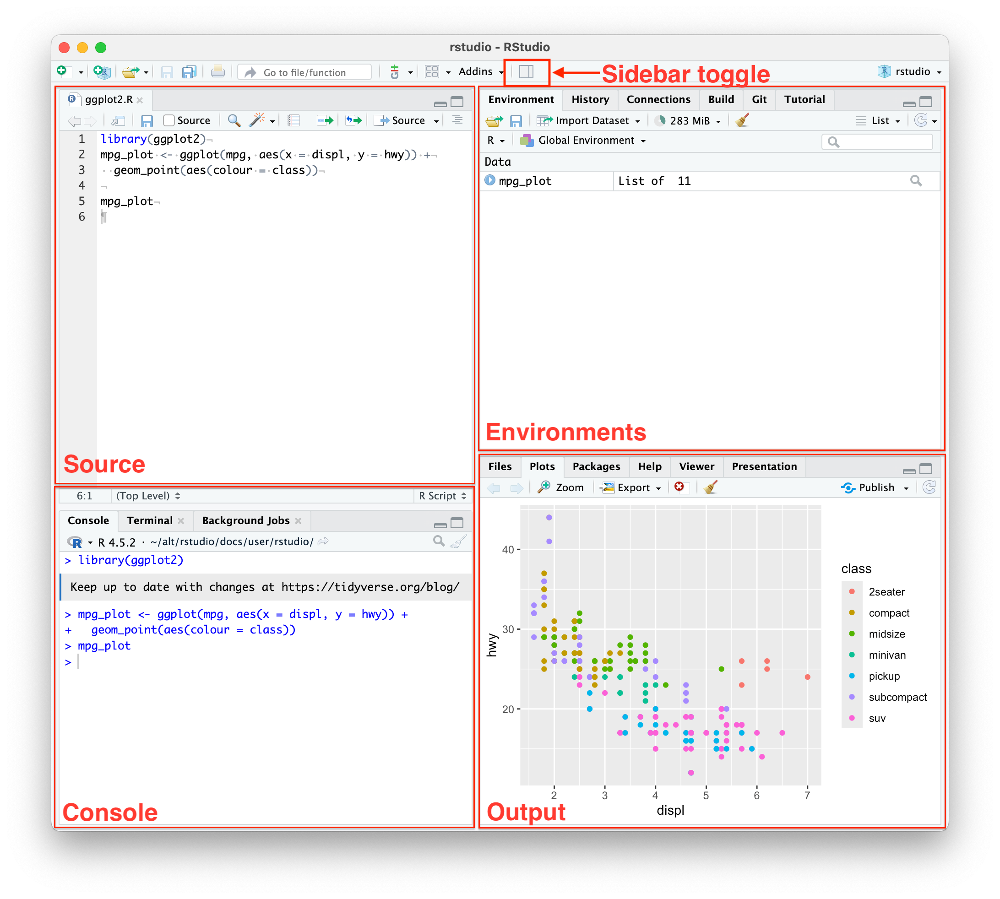
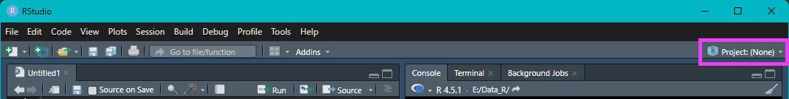
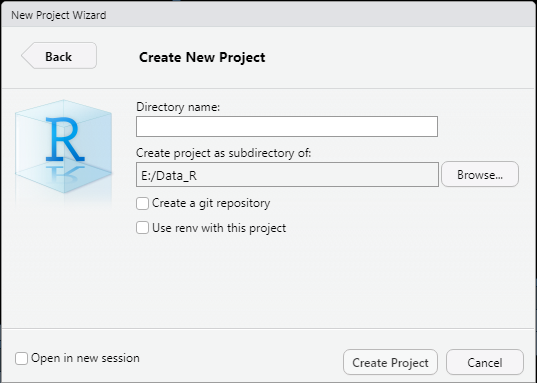
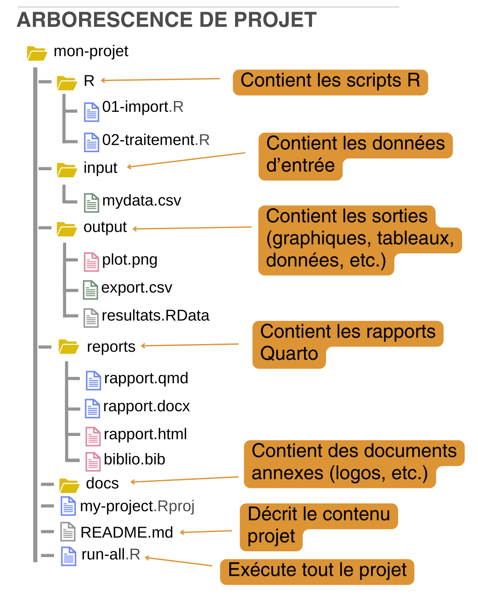
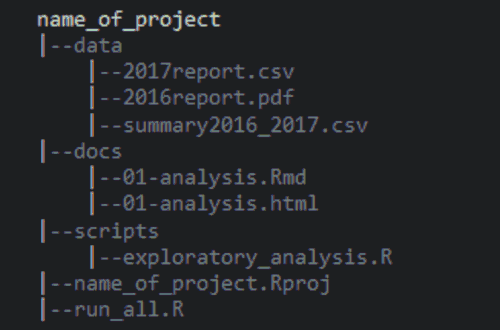
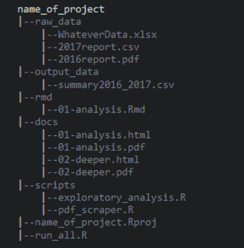
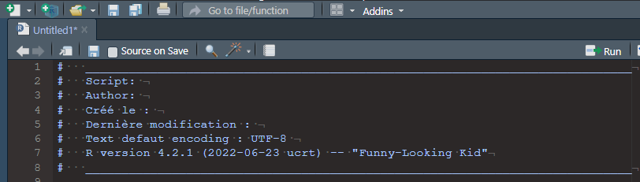
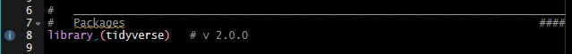
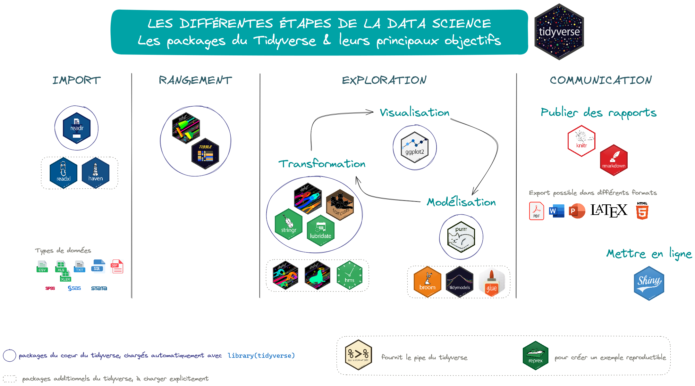
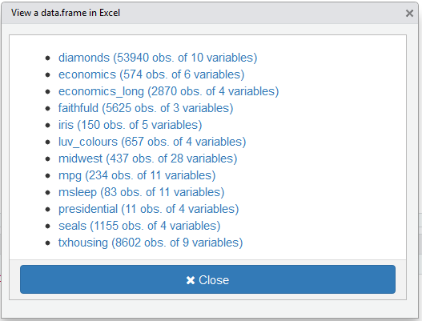

```{r}
#| label: initR # Chargement du package et des données utilisés dans les diapos
#| echo: false

rm(list = ls())

#   ____________________________________________________________________________
#   R version                                                               ####
#   R version 4.6.0 (2026-04-24 ucrt) -- "Because it was There"

#   ____________________________________________________________________________
#   Packages                                                                ####
library(tidyverse)    # v2.0.0
library(knitr)        # v1.51
library(kableExtra)   # v1.4.1 ; pour scroll_box
library(questionr)    # v0.8.2
library(Ecdat)        # v0.4.7

#   ____________________________________________________________________________
#   Données utilisées dans les exemples                                     ####

data(Journals)

#   ____________________________________________________________________________
#   Options des chunks                                                      ####
#   Fonction pour n'afficher que quelques lignes de l'output des chunks
##  Source : https://forum.posit.co/t/showing-only-the-first-few-lines-of-the-results-of-a-code-chunk/6963
hook_output <- knit_hooks$get("output")
knit_hooks$set(output = function(x, options) {
   lines <- options$output.lines
   if (is.null(lines)) {
     return(hook_output(x, options))  # pass to default hook
   }
   x <- unlist(strsplit(x, "\n"))
   more <- "..."
   if (length(lines) == 1) {        # first n lines
     if (length(x) > lines) {
       # truncate the output, but add ....
       x <- c(head(x, lines), more)
     }
   } else {
     x <- c(more, x[lines], more)
   }
   # paste these lines together
   x <- paste(c(x, ""), collapse = "\n")
   hook_output(x, options)
})
```

#     Préambule

##    `r fontawesome::fa("table")` Jeu de données utilisé dans cette session {background-color="#9ed6e3" .unlisted .unnumbered}

Les exemples s'appuient sur le jeu de données `Journals`, disponible dans le package {Ecdat}

Ce jeu de données se compose de 180 observations décrites par 10 variables

- **title** : titre de la revue
- **pub** : éditeur
- **society** : société
- **libprice** : prix de l'abonnement
- **pages** : nombre de pages
- **charpp** : nombre de caractères par page
- **citestot** : nombre total de citations
- **date1** : année de création de la revue
- **oclc** : nombre d'abonnements
- **field** : domaine de la revue

#     Présentation des logiciels R et RStudio

##    **R** *vs* **RStudio**

###   {width="8%"}

**Langage de programmation** et **logiciel libre** pour la statistique, la science des données et la visualisation, développé depuis 1993

- Il ne s'agit pas d'un logiciel "statique" que l'on installe une fois pour des années, c'est tout un écosystème en **perpétuelle évolution, constamment mis à jour et amélioré**
- C'est un logiciel libre distribué selon les termes de la licence GNU GPL (*open source*), qui bénéficie d'une large communauté internationale et qui offre une multitude de fonctionnalités grâce aux packages 
- Compatible avec la plupart des systèmes d'exploitation (Windows, MacOS, Linux)
- Disponible en téléchargement sur le site du [CRAN](http://cran.r-project.org) (*Comprehensive R Archive Network*)

<br />

::: {.callout-note appearance="simple"}
Dernière version disponible au 21 sept. 2026 : R version 4.6.1 (2026-06-24 ucrt) -- "Happy Hop"

*Cette session utilise R version 4.6.0 (2026-04-24 ucrt) -- "Because it was There"*
:::

---

####  Les objets

La programmation dans **R** repose sur des **objets**,  qui apparaîtront dans la fenêtre *Environment* de **RStudio**  
$\Rightarrow$ **Dans R, presque tout est un objet : nombres, textes, tableaux, graphiques, modèles, fonctions...**

- Un objet est une structure de données avec
  + un nom (*exemple* : x, donnees, modele)
  + un contenu (une ou plusieurs valeurs)
  + un type / mode (*numeric*, *character*, *logical*, etc.)
  + parfois une classe (*vector*, *matrix*, *data.frame*, *lm*, *ggplot*, etc.)

- On crée un objet avec l'opérateur d'affectation noté `<-`, de la façon suivante : `nom_objet <- valeur`  
*Exemples*  
```{r}
#| label: objets

x <- 3
nom <- "Alice"
df <- data.frame(age = c(20, 25), sexe = c("F", "H"))
```

:::{.callout-note appearence="minimal"}
- S'il n'existe aucun objet qui porte le nom `nom_objet` dans votre environnement de travail **R**, l'exécution de la commande crée un nouvel objet
- S'il existe déjà un objet avec le nom `nom_objet`, l'exécution de la commande écrase/met à jour l'ancien objet avec la nouvelle valeur
:::

----

##### À quoi servent les objets ?

- À stocker des données (vecteurs de mesures, colonnes d'un tableau, etc.) et des résultats (moyennes, modèles statistiques, tests, prédictions, etc.)
- À structurer l'information : organiser les données en tableaux (*dataframes*/*tibbles*), listes, matrices, etc.
- À réutiliser du code : les fonctions, graphiques, modèles sont eux-mêmes des objets **R**
$\Rightarrow$ En pratique, presque toutes les commandes **R** créent ou manipulent des objets

:::{.callout-tip title="Comment nommmer les objets ?"}
Vous pouvez donner n'importe quel nom à vos objets, en respectant certaines règles

- le nom ne peut pas commencer par un chiffre
- le nom ne doit pas contenir de caractères spéciaux (le _underscore_ `_` est autorisé)
- le nom ne doit pas être celui d'une fonction **R** déjà existante (*exemple* : mean)
:::

---

##### Les vecteurs

Le **vecteur** est le type d'objet de base, le plus simple  
Il contient une ou plusieurs valeurs de même type

- du texte - `character` -
- des nombres entiers - `integer` - ou réels - `double` ou `numeric` -
- des valeurs logiques -`TRUE`(vrai) ou `FALSE`(faux) - 

*Exemples* 
```{r}
#| label: typeobjets
#| eval: false

v_log <- c(TRUE, FALSE, TRUE)
v_num <- c(1.5, 2.7, 3.0)
v_txt <- c("rouge", "vert", "bleu")
```

---

##### Les objets plus complexes (1/2)

- Les **_dataframes_** : des tableaux de données à 2 dimensions, où les lignes sont les observations et les colonnes les variables $\Rightarrow$ les colonnes peuvent avoir des types différents, mais ont toutes la même longueur

`r fontawesome::fa("lightbulb", fill = "#A626A4")` **Les données au format .csv ou .xls importées sous R sont des _dataframes_**

*Exemple*  
```{r}
#| label: df
#| eval: false

df <- data.frame(id   = 1:3,
                 age  = c(20, 25, 30),
                 sexe = c("F", "H", "H"),
                 poids = c(55.2, 70.1, 68.4))
```

- Les **matrices** : un objet à 2 dimensions (lignes × colonnes) qui contient des éléments du même type (des données numériques en général)

*Exemple* 
```{r}
#| label: matrice
#| evla: false

M <- matrix(1:6, nrow = 2, ncol = 3)
```

---

##### Les objets plus complexes (2/2)

- Les **listes** : une collection d'objets **R**, qui peuvent être de types différents $\Rightarrow$ une liste peut contenir des vecteurs, des matrices, des *dataframes*, d'autres listes, des fonctions, etc.

*Exemple*  
```{r}
#| label: liste
#| eval: false

une_liste <- list(age = c(20, 25, 30),
                  sexe = c("F", "H", "H"),
                  modele = lm(poids ~ age, data = df))
```

- Les **facteurs** : un format spécial dans **R** pour les variables catégorielles (qualitatives), les modalités sont listées avec `levels` et peuvent être ordonnées (on parle alors d'*ordered factor*)

*Exemple*
```{r}
#| label: facteur
#| eval: false

sexe <- factor(c("F", "H", "F", "H"), 
               levels = c("F", "H"))
```

###   {width="15%"}

**Environnement de développement intégré (IDE)** spécialement conçu pour **R** avec une interface conviviale

::::: {.columns}
:::: {.column width="50%"}
- Logiciel *open source*, gratuit et disponible pour la plupart des systèmes d'exploitation
- Version locale (*RStudio Desktop*) ou serveur (*RStudio Server*)
- Quatre cadrants pour visualiser facilement les scripts, l'aide, les graphiques
  + **Source** (en haut à gauche) : éditeur de scripts
  + **Environnement** (en haut à droite) : environnement de travail (objets, fonctions, etc.), historique, connexions, tutoriels
  + **Console** (en bas à gauche) : exécution des commandes
  + **Sorties** (en bas à droite) : fichiers, graphiques, packages, aide, visualiseur, présentation
::::

:::: {.column width="5%"}
<!-- colonne vide pour espacer les 2 colonnes de texte -->
::::

:::: {.column width="45%"}
{width="65%" fig-alt="Disposition des volets RStudio."}

<small>Disposition des volets **RStudio**. <br /> *Source : [RStudio User Guide Release 2026.08.2](https://docs.posit.co/ide/user/ide/guide/ui/ui-panes.html) - Dernier accès : 2026-09-08*</small>
::::
:::::

---

####  1. Les scripts

Des fichiers "texte" pour des traitements qui vont nécessiter des modifications. 

**Avantages**

-   garder la trace des lignes de code
-   exécuter une/des ligne(s) de code : bouton `Run` ou raccourci clavier `Ctrl + Entrée` ou `Ctrl + R`
-   modifier le code
-   ajouter des commentaires
-   réutiliser le code sur d'autres jeux de données

---

####  2. L'environnement / L'historique / Les connexions

- Onglet **Environment**

  + objets (données, fonctions, résultats) créés dans cet environnement
  + 2 affichages possibles : liste ou grille (permet de supprimer des objets en cochant la case à côté du nom + clic sur l'icone `Balai`)

- Onglet **History**

  + historique des commandes exécutées
  + on peut renvoyer le code dans la console ou la source

- Onglet **Connections**

  + pour se connecter à diverses sources de données (par ex. bases de données externes)

---

####  3. La console

**C'est l'équivalent d'une calculatrice**

- Sert à effectuer et afficher les résultats de calculs de base (`+`, `-`, `\*`, `/`, etc. )
- Possibilité d'utiliser des fonctions spécifiques : `sum()`, `abs()`, `round()`, etc.
- Les commandes sont exécutées au fur et à mesure qu'elles sont écrites en appuyant sur la touche `Entrée` 

:::{.callout-tip appearence="minimal"}
**On peut naviguer dans l'historique des commandes pour en rappeler une, à l'aide des flèches $\uparrow$ et $\downarrow$**
:::

---

####  4. Les graphiques/ Les packages / L'aide

- Onglet **Plots**

  + fenêtre où s'affichent les graphiques que l'on crée dans les scripts (ou la console)
  + possibilité de zoomer, de naviguer entre les graphiques, de les copier
  + export des graphiques au format image (jpeg, png, tiff) ou pdf

- Onglet **Packages**

  + liste des packages installés sur la machine
  + installation de nouveaux packages / mise à jour des packages installés
  + un clic sur le nom d'un package affiche les pages d'aide de ce package

- Onglet **Help**

  + afficher la documentation de chaque fonction
  + accéder à des manuels ou des à aides-mémoire (*cheatsheets*)

---

::: {.callout-tip title="Comment installer les logiciels ?"}
L'installation se fait **dans cet ordre**

1. **R** à partir du [CRAN](http://cran.r-project.org){target="_blank"} (*Comprehensive R Archive Network*) 
2. **RStudio** via le site de [Posit](https://posit.co/downloads){target="_blank"}

Le logiciel **R** est régulièrement mis à jour, et contrairement à **RStudio**, il n'y a pas de message d'alerte pour vous prévenir.

`r fontawesome::fa("lightbulb", fill = "#A626A4")` **Pensez à vérifier régulièrement et à mettre à jour R pour pouvoir bénéficier des dernières fonctionnalités !**
::: 

###   Les packages

- Bibliothèques de fonctions et de données, développées par la communauté
- Améliorent les fonctionnalités de base de **R** ou proposent des fonctionnalités supplémentaires
- Contiennent de la documentation sur les fonctions qu'ils proposent

*Exemple* : [{ggplot2}]{.pkg}, [{dplyr}]{.pkg}, [{graphics}]{.pkg}

---

####  **Installer** un package

**L'installation d'un package dépend de l'endroit où les auteurs l'ont déposé**

- Si le package est sur le CRAN, l'installation se fait avec la fonction `install.packages()`  

```{r}
#| label: installPkg
#| eval: false

# Installer le package ggplot2
install.packages("ggplot2")
```

<br />

- Si les packages sont sur des dépôts, l'installation se fait grâce au package [[{remotes}]{.pkg}](https://remotes.r-lib.org/), avec des fonctions qui dépendent du dépôt

  + GitHub : fonction `install_github()`
  + GitLab : fonction `install_gitlab()`

```{r}
#| label: remotes
#| eval: false

# Installer le package viewxl qui se trouve sur un dépôt Github
remotes::install_github("dreamRs/viewxl")
```

<br />

::: {.callout-tip appearance="simple"}
**L'installation ne doit pas être refaite à chaque exécution du script !**
:::

---

####  **Charger** un package

**Cette étape est nécessaire à chaque fois que l'on veut utiliser une ou plusieurs fonctions d'un package**

<br />

```{r}
#| label: library
#| eval: false
#| include: true

# Charger le package ggplot2
library(ggplot2)
```

<br />

:::{.callout-warning title="La gestion des packages"}
Les packages évoluent, les fonctions changent et avec une nouvelle version de package, votre code peut ne plus s'exécuter sans erreur

`r fontawesome::fa("lightbulb", fill = "#A626A4")` **Il est vivement recommandé de lister les packages utilisés au début de vos scripts, pour les identifier plus rapidement, en notant leur version**

- "à la main"
```{r}
#| label: listePkg
#| eval: false

library(tidyverse)    # v2.0.0
library(questionr)    # v0.8.2
```

- de façon automatique
```{r}
#| label: sessionInfo
#| eval: false

library(tidyverse)
library(questionr)

packages_utilises <- sessionInfo()
```
:::

---

####  Que se passe-t'il quand on installe une nouvelle version de **R** ?

- Seul les packages de base sont installés, dans leur version mise à jour
- Les packages qui ont été installés en fonction des besoins ne le sont pas, il faut les réinstaller

:::{.callout-note appearance="simple"}
**RStudio** affiche un avertissement en haut des scripts qui appellent des packages qui ne sont pas installés
:::

<br />

##### Comment réinstaller les packages automatiquement ?
**Les étapes à suivre**

- Créer un script **R** qui va contenir la liste des packages à installer, quel que soit le projet dans lequel vous travaillez  

  + pour les packages qui se trouvent sur le CRAN, lister les packages dans la commande ` install.packages()`  
  + pour les packages qui se trouvent sur les dépôts GitHub, l'installation se fera avec la commande `install_github()` du package [[{remotes}]{.pkg}](https://remotes.r-lib.org/)
- Mettre à jour le script au fur et à mesure des installations de nouveaux packages
- Exécuter le contenu du script, en ayant pris soin auparavant d'actualiser la version de **R** sous **RStudio** si plusieurs sont installées !

---

*Exemple de script*
```r
#   ____________________________________________________________________________
#   Script: Packages à installer après chaque nouvelle installation de R
#   Author: Sandrine.Lyser
#   Créé le : 2026-06-19
#   Dernière modification : 2026-09-07
#   Text defaut encoding : UTF-8
#   ____________________________________________________________________________


# Packages du CRAN
install.packages(c("tidyverse", "esquisse", "RColorBrewer", "remotes", "mapsf"),
                 dependencies = TRUE)

# Autres packages (sur github par exemple)
remotes::install_github("lorenzwalthert/strcode", dependencies = TRUE)
                        
remotes::install_github("dreamRs/viewxl", dependencies = TRUE)
```

---

::: {.callout-note title="Le préfixage"}
La notation
```{r}
#| label: prefixOui
#| eval: false
#| include: true

dplyr::filter(Journals, field == "Econometrics")
```
peut remplacer le code
```{r}
#| label: prefixSans
#| eval: false
#| include: true

library(dplyr)
filter(Journals, field == "Econometrics")
```

<br />

**Avantages**

- Évite les conflits si plusieurs packages ont une fonction avec le même nom (mais des paramètres différents)  
*Exemple*  la fonction `filter()` existe dans les packages {stats} et {dplyr}
- Identifie le package d'où provient une fonction
- Ne charge pas la totalité d'un package pour n'utiliser qu'une seule de ses fonctions
:::

---

::::: {.callout-tip title="Vous ne savez pas comment faire pour citer **R** ainsi que les packages que vous avez utilisés dans vos travaux ?"}
La fonction `citation()` est là pour vous aider ! 

::::{.columns}
:::{.column width="45%"}
- **Pour citer la version de R**

```{r, output.lines=30}
#| label: citeR

# Citer R
citation()
```
:::

::: {.column width="5%"}
<!-- colonne vide pour espacer les 2 colonnes de texte -->
:::

:::{.column width="50%"}
- **Pour citer un package**

```{r, output.lines=30}
#| label: citePkg

# Citer un package (ici ggplot2)
citation("ggplot2")
```
:::
::::

:::::

#     Travailler avec les projets **RStudio** et reproductibilité

##    Qu'est-ce que la reproductibilité en science des données ?

**= Processus qui peut être reproduit par une autre personne et/ou à partir des mêmes données mises à jour et qui permet d'expliquer et partager son travail**

<br />

S'appuie sur **trois grands principes** interagissant entre eux et non séquentiels[^reproductibilité]

1. Organiser son travail
2. Coder pour les autres
3. Automatiser le plus possible


<br />

[^reproductibilité]: Orozco, V., C. Bontemps, E. Maigné, V. Piguet, A. Hofstetter, A. Lacroix, F. Levert, and J-M. Rousselle. 2020. “How To Make A Pie: Reproducible Research for Empirical Economics and Econometrics.” Journal of Economic Surveys 34 (5) : 1134–69. https://doi.org/10.1111/joes.12389.

---

###    Comment travailler de façon reproductible sous **R** et **RStudio** ?

1. En utilisant les **projets RStudio** : on isole chaque analyse
2. En stockant ses traitements dans des **scripts R** : on garde une trace des commandes, pas de travail dans la console
3. En utilisant les **chemins relatifs** : pour exécuter sans problème le code sur un autre ordinateur
4. En prêtant une attention à la **gestion des packages** : versions et dépendances
5. En **documentant** son travail : commentaires, fichier README

---

::: {.callout-note title="Zoom sur l'encodage"}
**L'encodage est un processus de conversion d'informations (texte, données, etc.) en un format lisible, compréhensible et exploitable par différents systèmes** $\Rightarrow$ il permet une compatibilité entre systèmes

- Il existe plusieurs encodages, comme par exemple : ASCII, ISO 8859-15, UTF-8
- Les encodages sont différents selon le système d'exploitation (Windows-1252 sous Windows, UTF-8 sous Linux ou Mac)

`r fontawesome::fa("lightbulb", fill = "#A626A4")` **Il est recommandé d'utiliser l'encodage UTF-8 pour les scripts et les données**, car c'est à l'heure actuelle l'encodage le plus universel

<br />
`r fontawesome::fa("gears", fill = "#A626A4")` **Comment peut-on définir l'encodage sous RStudio ?**  
- Allez dans `Tools > Global Options > Code > Saving > Default text encoding`  
- Sélectionnez `UTF-8`
:::

---

::: {.callout-tip title="La fonction `set.seed()`"}
**Automatiser c'est aussi pouvoir refaire les mêmes calculs et obtenir les mêmes résultats**

$\Rightarrow$ utiliser la fonction `set.seed()` permet de garantir la reproductibilité des résultats de tout travail inscrit dans un script **R** qui implique de l'aléatoire (simulation permutation, bootstrap, etc.)

`r fontawesome::fa("lightbulb", fill = "#A626A4")` **Placée avant une opération aléatoire (fonctions `sample()`, `rnorm()` par exemple), elle permet de retrouver les mêmes résultats à chaque exécution**

```{r}
#| label: setseed

set.seed(123)     # 'Graine' (valeur quelconque) pour le générateur aléatoire
sample(1:10, 5)   # Un tirage reproductible
```
:::

###   Les projets **RStudio** 

Les projets **RStudio** sont utiles pour 

- **organiser plus facilement son travail** : 1 projet **RStudio** = 1 projet de recherche / 1 étude / 1 cours, etc.  
$\Rightarrow$ environnement isolé, pas de conflits entre projets
- **regrouper dans un même dossier tous les scripts** : scripts **R**/quarto, fonctions, données, résultats, graphiques, etc. 
- **améliorer la portabilité et faciliter les collaborations** : utilisation des chemins de fichiers relatifs
$\Rightarrow$ reproductibilité facilitée

::: {.callout-note title="Chemins absolus/relatifs"}
- Le chemin absolu est exprimé par rapport au disque dur, à l'ordinateur  
*Exemple* : `C:/Users/...`

- Le chemin relatif est exprimé par rapport au projet  
*Exemple* : `data/mon_fichier.csv`

`r fontawesome::fa("lightbulb", fill = "#A626A4")` **Le répertoire par défaut du projet est le dossier où est enregistré le projet sur votre machine** 
:::

--- 

####  Comment créer un projet ?

À partir de l'icône dédiée en haut à droite de **RStudio**

{width="65%" fig-align="center" fig-alt="Icone nouveau projet RStudio."}

Cliquez sur `New Project > New Directory > New Project` et complétez les informations requises 

:::::: {.content-visible unless-format="pdf"}
:::::{.columns}
::::{.column width="25%"}
- le nom du dossier/projet 
- son emplacement (dossier de votre choix)
::::

:::: {.column width="5%"}
<!-- colonne vide pour espacer les 2 colonnes de texte -->
::::

:::: {.column width="25%"}
{width="95%" fig-align="center" fig-alt="Menu : créer un nouveau projet."}
::::

:::: {.column width="5%"}
<!-- colonne vide pour espacer les 2 colonnes de texte -->
::::

:::: {.column width="35%"}
::: {.callout-tip appearance="simple"}
**Quand le projet est créé**  
- **RStudio** redémarre et se place dans ce projet  
- le projet apparaît dans l'onglet *Files* de **RStudio**

`r fontawesome::fa("lightbulb", fill = "#A626A4")` Pour ranger efficacement les différents documents liés à l'analyse, vous pouvez créer les sous-dossiers  
- soit en cliquant sur `New Folder` dans le menu en haut de l'onglet *Files*  
- soit de façon classique, à partir de l'explorateur de fichier de votre machine
:::
::::
:::::
::::::

:::::: {.content-visible when-format="pdf"}
- le nom du dossier/projet 
- son emplacement (dossier de votre choix)

{width="55%" fig-align="center" fig-alt="Créer un nouveau projet."}

::: {.callout-tip appearance="simple"}
**Quand le projet est créé**  
- **RStudio** redémarre et se place dans ce projet  
- le projet apparaît dans l'onglet *Files* de **RStudio**

`r fontawesome::fa("lightbulb", fill = "#A626A4")` Pour ranger efficacement les différents documents liés à l'analyse, vous pouvez créer les sous-dossiers  
- soit en cliquant sur `New Folder` dans le menu en haut de l'onglet *Files*  
- soit de façon classique, à partir de l'explorateur de fichier de votre machine
:::

::::::

--- 

####  Comment structurer ses projets ?

**Choisissez la structuration qui vous correspond le mieux** pour **rassembler** tous les éléments liés au projet dans des dossiers/sous-dossiers qui séparent données source/créées, scripts, documentation, résultats, etc.

::: {.callout-tip appearance="simple"}
**Chacun s'organise de la façon qu'il juge la plus adaptée à ses usages, en gardant en tête que ce sont les données initiales et les scripts de traitement qui sont les plus importants pour pouvoir rejouer les analyses**
:::

::::: {.content-visible unless-format="pdf"}
:::: {.columns}
::: {.column width="30%"}
{width="55%" fig-align="center" fig-alt="Structure de projet RStudio."}
:::

::: {.column width="3%"}
<!-- colonne pour espacer les 2 colonnes de texte -->
:::

::: {.column width="30%"}
{width="70%" fig-align="center" fig-alt="Exemple de structure minimale."}
:::

::: {.column width="3%"}
<!-- colonne vide pour espacer les 2 colonnes de texte -->
:::

::: {.column width="30%"}
{width="65%" fig-align="left" fig-alt="Exemple de structure optimale."}
:::
<center><small>Exemples de structuration de projets **R** <br /> *Source des figures 2 & 3 : <https://learn.r-journalism.com/en/publishing/workflow/r-projects/>{target="_blank"} - Dernier accès : 2026-09-08*</small></center>
::::
:::::

::: {.content-visible when-format="pdf"}
{width="33%" fig-alt="Structure de projet RStudio."}
{width="33%" fig-alt="Exemple de structure minimale."}
{width="33%" fig-alt="Exemple de structure optimale."}

<center><small>Exemples de structuration de projets **R** <br /> *Source (figures 2 & 3) : <https://learn.r-journalism.com/en/publishing/workflow/r-projects/>{target="_blank"} - Dernier accès : 2026-09-08*</small></center>
:::

###   Les scripts **R**

- Ils permettent de **garder la trace** du processus de création de chaque variable, tableau, figure, etc., ce qui permet de refaire les traitements dans leur globalité  
- Ils sont **facilement partageables** avec d'autres, sous réserve de respecter des pratiques de "bon" usage  
  + coder de façon compréhensible avec des commentaires et en documentant ses fonctions  
  + donner des noms explicites aux objets et fonctions
  + utiliser les conventions de nommage, notamment pour distinguer les variables d'origine des variables créées

::: {.callout-tip appearance="simple"}
- Pour les **variables**, utiliser un **nom**  
*Exemple* : `temperature_max`
- Pour les **fonctions**, utiliser un **verbe**  
*Exemple* : `create.map` serait une fonction qui permettrait de créer une carte
- Pour **distinguer variables d'origine / variables recodées**, on peut utiliser un préfixe ou un suffixe  
*Exemple* : `age` est la variable d'origine et `age_recod` est la variable recodée
:::

---

:::{.callout-note title="Les conventions de nommage"}
Il existe différentes conventions

- **`allowercase`** : tout en minuscule, sans séparateur
- **`period.separated`** : tout en minuscule, mots séparés par des points
- **`underscore_separated`** : tout en minuscule, mots séparés par un *underscore* (`_`)
- **`lowerCamelCase`** : première lettre des mots en majuscule, à l'exception du premier mot ; et si nom simple, tout en minuscule
- **`UpperCamelCase`** : première lettre des mots en majuscule, y compris le premier et même lorsque le nom est composé d'un seul mot

`r fontawesome::fa("lightbulb", fill = "#A626A4")` **Possibilité de mixer les conventions mais en gardant une cohérence afin de faciliter la compréhension des fichiers et du code**
:::

<br/>

::: {.callout-warning appearance="simple"}
**R est sensible à la casse** ce qui signifie que `variable` et `Variable` sont deux objets différents
:::

---

####  Comment organiser ses scripts ?

- Prévoir un **pipeline analytique**  

  > *= séquence ordonnée de traitements automatisés permettant de transformer, analyser et visualiser des données de façon reproductible et efficace*  
  > + import et préparation des données (nettoyage, fusion, filtrage)  
  > + traitement statistique (modélisation, transformation, calculs)  
  > + production des résultats (graphiques, tableaux, rapports)

- Utiliser une convention de dénomination des fichiers et leur donner des noms explicites

::: {.callout-tip appearance="simple"}
Pour les **fichiers**, on peut les nommer avec la structure `numero_nom_millesime.extension`, sans symboles spéciaux dans le nom  
*Exemple* : `01_import_donnees_20250606.R`

Les **caractères spéciaux** qui sont à proscrire sont ``-.,;:\/$^`, ainsi que les caractères accentués
:::

::: {.callout-note title="Ressources sur le processus d'analyse et de communication des données reproductibles"}
`r fontawesome::fa("globe", fill = "#A626A4")` [R Workflow](https://hbiostat.org/rflow){target="_blank"}

`r fontawesome::fa("globe", fill = "#A626A4")` [Reproducible analytical pipeline](https://raps-with-r.dev/)
:::

---

####  Comment structurer ses scripts ? 

1.   Commencer l'écriture du script par les **métadonnées** (titre, auteur, date, version de **R**, encodage, etc.)

{width="30%" fig-align="center" fig-alt="En-tête de script."}

2.   Ajouter la **liste des packages utilisés** et leur version 

::: {.content-visible unless-format="pdf"}
3.   **Structurer** en parties et sous-parties grâce à l'*addin* `strcode` (`r fontawesome::fa("gears", fill = "#A626A4")` *`remotes::install_github("lorenzwalthert/strcode")`*)

```r
#   ____________________________________________
#   Titre 1                                 ####
##  ............................................
##  Titre 2                                 ####
```
:::

::: {.content-visible when-format="pdf"}
3.   **Structurer** en parties et sous-parties grâce à l'*addin* `strcode`   
`r fontawesome::fa("gears", fill = "#A626A4")` *`remotes::install_github("lorenzwalthert/strcode")`*

```r
#   ____________________________________________
#   Titre 1                                 ####
##  ............................................
##  Titre 2                                 ####
```
:::

4. Commenter les scripts (avec le signe `#`), en particulier pour expliquer les étapes-clés

:::{.callout-tip title="Comment passer une ligne entière en commentaires ?"}
`r fontawesome::fa("lightbulb", fill = "#A626A4")` **Avec un raccourci clavier** : se placer sur la ligne et cliquer sur `CRTL + MAJ + C`
:::

---

:::::{.callout-note title="Respecter des règles pour faciliter la lecture"}

- Retour à la ligne régulièrement (**la longueur maximale recommandée d'une ligne est 80 caractères**) et après chaque pipe (`%>%` ou `|>`)  
- L'indentation se fait grâce à la touche `TAB`. Le raccourci `Ctrl+I` sert à réindenter les lignes de code sélectionnées  
- Les opérateurs qui lient les objets entre eux `(=, +, -, <-, etc.)` sont entourés d'espaces  
- Les opérateurs qui modifient un objet ou sélectionnent une partie d'un objet `(:, !!, $, @, [, ], [[, ]])` ne sont pas entourés d'espaces

::::{.columns}
:::{.column width="50%"}

```r
# On écrit 
1 + 1 = 2
dataframe$variable
```
:::

:::{.column width="50%"}

```r
# et non 
1+1=2
dataframe $ variable
```
:::
::::

- On insère un espace après la virgule mais pas avant, comme en français !  
- On ne met pas d'espace avant ou après les parenthèses  
- En revanche, les opérateurs de comparaison doivent être entourés d'espace pour ne pas être mal interprétés par **R**

::::{.columns}
:::{.column width="50%"}

```r
# On écrit
mean(x, na.rm = TRUE)  
1 < -10
```
:::

:::{.column width="50%"}

```r
# et non 
mean ( x , na.rm = TRUE )
1<-10
```
:::
::::

:::::

---

::: {.callout-tip title="Aide pour écrire les scripts"}
`r fontawesome::fa("gears", fill = "#A626A4")` Activer les options de diagnostic pour que **RStudio** signale automatiquement les erreurs dans les scripts : `Tools > Global Options > Code > Diagnostics`

{width="100%" fig-align="center" fig-alt="Diagnostic de script."}

`r fontawesome::fa("r-project", fill = "#A626A4")` package [{styler}](https://github.com/r-lib/styler){target="_blank"} : mettre en forme le code selon le [Tidyverse Style Guide](https://style.tidyverse.org/index.html){target="_blank"} (ou selon son propre style)  

`r fontawesome::fa("r-project", fill = "#A626A4")` package [{lintr}](https://lintr.r-lib.org/){target="_blank"} : vérifier que le code est conforme à un guide de style donné
:::

---

:::{.callout-tip title="Le fichier README"}
Il est recommandé de créer un fichier README, dans le dossier du projet, qui présente le **projet**, sa **structuration** et les **étapes d'exécution des différents script** pour comprendre, reproduire et utiliser le projet

<br />
`r fontawesome::fa("lightbulb", fill = "#A626A4")` **Un README est généralement un fichier au format .txt ou .md (markdown)**

<br />
**Exemple de fichier README**

```{txt}
# BulleR

Projet de la session

## Structure
- data/ : données 
    ├── sources/ : données sources, données brutes
    └── produites/ : données produites
- scripts/ : scripts R, qmd
- outputs/ : graphiques et tableaux exportés
- docs/ : rapports et supports

## Comment reproduire les analyses
1. Ouvrir le projet `BulleR`
2. Exécuter les scripts dans l'ordre (01_import.R, 02_nettoyage.R, etc.)
3. Les graphiques générés sont enregistrés dans le dossier outputs
4. Le rapport d'étude est enregistré dans le dossier docs
```
:::


#     Introduction au `tidyverse`

##    **R** vs `tidyverse`

- Deux “façons” d'écrire du **R**
- Mêmes résultats, styles différents

###   **R** de base

- Fonctions et syntaxe incluses dans **R**
- Syntaxe parfois hétérogène
- Beaucoup d'opérateurs spéciaux pour manipuler les données : `[`, `[[`, `$`, `which()`, `apply()`, etc.
- Les fonctions s'imbriquent, création de nombreux objets intermédiaires
- Code souvent "compact", mais parfois difficile à lire pour les débutants

*Exemple*
```r
res <- head(subset(Journals, citestot > 20))
# ou
tmp <- Journals[Journals$citestot > 20, ]
res <- head(tmp)
```

###   tidyverse

- Ensemble de packages qui reprennent des opérations courantes de **R** de façon unifiée, conçus pour travailler ensemble
  + uniformité des formats d'entrée et de sortie
  + syntaxe commune entre les packages
  + les noms de fonctions sont des verbes : `filter()`, `select()`, `mutate()`, `summarise()`, `arrange()`, `join()`
- Philosophie "tidy" : données en tables "propres", fonctions cohérentes, code lisible
- L'accent est mis sur la lisibilité et la chaîne d'opérations, via l'opérateur *pipe* `|>`  
$\Rightarrow$ le code suit l'ordre logique des étapes, avec moins d'objets intermédiaires, moins de parenthèses imbriquées

*Exemple*

```r
library(dplyr)

Journals |> 
  filter(citestot > 20) |> 
  head()
```

---

####  L'opérateur *pipe*

- Opérateur qui permet d'enchaîner des opérations : il prend la sortie d'une fonction (ou d'une expression) et la passe automatiquement comme **premier** argument à la fonction suivante
- Initialement fourni dans le package [{magrittr}](https://magrittr.tidyverse.org/){target="_blank"} et noté `%>%`
- Implémenté dans le langage **R** de base depuis la version 4.1.0 et noté `|>`

```{r}
#| label: pipenatif
#| eval: false

data |>
  fonction1() |>
  fonction2() |>
  fonction3()
# équivaut à
fonction3(fonction2(fonction1(data)))
```

::: {.callout-tip appearance="simple"}
**Il est recommandé d'utiliser le pipe natif de R** `|>`

<br />
`r fontawesome::fa("gears", fill = "#A626A4")` **Comment utiliser le pipe natif sous RStudio ?**  
- Allez dans `Tools > Global Options > Code > Editing`  
- Cochez `Use native pipe operator, |> (requires R 4.1+)`
:::

---

####  Les *tibbles*

- **Version modernisée des _dataframes_**, proposée dans le cadre du `tidyverse`
- Plus pratiques à utiliser que les *dataframes* "classiques"
- Plus rapides à manipuler (et plus stables) que les *dataframes*
- Il est possible de convertir d'un type à l'autre
  + *dataframe* $\rightarrow$ *tibble* : avec la fonction `as_tibble()` du package [{tibble}](https://tibble.tidyverse.org/){target="_blank"}  
  + *tibble* $\rightarrow$ *dataframe* : avec la fonction **R** de base `as.data.frame()`

---

:::{.callout-note title="Aperçu des formats"}
**_dataframe_**
```{r}
#| label: dataframe 
#| echo: !expr c(2:3)

options(width = 150)
Journals |> 
  head(2)
```

**_tibble_**
```{r}
#| label: tibble

Journals |> 
  as_tibble() |> 
  head(2)
```
:::
  
##    Installation du `tidyverse`

- `r fontawesome::fa("gears", fill = "#A626A4")` La commande `install.packages("tidyverse")` installe simultanément plusieurs packages

  + [{dplyr}](https://dplyr.tidyverse.org/){target="_blank"} : manipulation des données
  + [{forcats}](https://forcats.tidyverse.org/){target="_blank"} : traitement des variables qualitatives
  + [{ggplot2}](https://ggplot2.tidyverse.org/){target="_blank"} : visualisation des données
  + [{lubridate}](https://lubridate.tidyverse.org/){target="_blank"} : manipulation des dates et heures
  + [{purrr}](https://purrr.tidyverse.org/){target="_blank"} : programmation
  + [{readr}](https://readr.tidyverse.org/){target="_blank"} : import de données
  + [{stringr}](https://stringr.tidyverse.org/){target="_blank"} : manipulation des chaînes de caractères
  + [{tibble}](https://tibble.tidyverse.org/){target="_blank"} : version modernisée des *dataframes*, plus pratiques à utiliser que les *dataframes* "classiques"
  + [{tidyr}](https://tidyr.tidyverse.org/){target="_blank"} : nettoyage, remise en forme des données

---

###   Les packages du `tidyverse` dans la *Data Science*

::: {.content-visible unless-format="pdf"}
{width="75%" fig-align="center" fig-alt="Datascience et tidyverse."}
:::

::: {.content-visible when-format="pdf"}
{width="80%" fig-align="center" fig-alt="Datascience et tidyverse."}
:::

#     Premières manipulations

##    Import/Export des données

- Depuis/vers des formats "plats" ou délimités (.csv, .txt)
- Depuis/vers des fichiers Excel ou issus d'autres logiciels de statistique (Stata, SPSS, etc.)
- Depuis/vers des bases de données relationnelles

<br />

:::{.callout-tip title="Pour l'import, bien étudier le jeu de données source, à l'aide des questions suivantes"}
1. La première ligne contient-elle le nom des variables ?  
2. Quel est le séparateur des colonnes : `,`, `;`, espace(s), `\t` ?  
3. Quel est le caractère utilisé pour indiquer les décimales : le point (à l'anglo-saxonne) ou la virgule (à la française) ?  
4. Les valeurs textuelles sont-elles encadrées par des guillemets ? Si oui, s'agit-il de guillemets simples (`'`) ou de guillemets doubles (`"`) ?  
5. Y a-t-il des valeurs manquantes ? Si oui, comment sont-elles indiquées ?  
:::

###   Les fonctions d'import

| Type de fichier | Séparateur de colonnes | Séparateur décimal | Tidyverse              | Base R                 |
|:----------------|:-----------------------|:-------------------|:-----------------------|:-----------------------|
| Délimité        | `,`                    | `.`                | `readr::read_csv()`    | `read.csv()`           |
|                 | `;`                    | `,`                | `readr::read_csv2()`   | `read.csv2()`          |
|                 | un espace (ou plus)    | `.`                | `readr::read_table()`  | `read.table()`         |
|                 | `\t`                   | `.`                | `readr::read_delim()`  | `read.delim()`         |
|                 | `\t`                   | `,`                | `readr::read_delim2()` | `read.delim2()`        |
| Excel           |                        |                    | `readxl::read_excel()` | `xlsx::read.xlsx()`    |
| SPSS            |                        |                    | `haven::read_spss()`   | `foreign::read.spss()` |
|                 |                        |                    | `haven::read_sav()`    |                        |
| Stata           |                        |                    | `haven::read_stata()`  | `foreign::read.dta()`  |
| SAS             |                        |                    | `haven::read_sas()`    | `foreign::read.ssd()`  |
| dBase           |                        |                    |                        | `foreign::read.dbf()`  |

: {tbl-colwidths="[10, 20, 20, 25, 25]"}

###   Les fonctions d'export

| Type de fichier | Tidyverse                          | Base R                                     |
|:----------------|:-----------------------------------|:-------------------------------------------|
| .txt            | `readr::write_delim(delim = "\t")` | `write.table()`                            |
| .csv            | `readr::write_csv()`               | `write.csv()`                              |
| .xlsx           | `openxlsx2::write_xlsx()`          |                                            |
|                 | `writexl::write_xlsx()`            |                                            |
| .dbf            |                                    | `foreign::write.dbf()`                     |
| .sav (SPSS)     | `haven::write_sav()`               | `foreign::write.foreign(package = "SPSS")` |
| .dta (Stata)    | `haven::write_dta()`               | `foreign::write.dta()`                     |

---

#####  Exemple d'import pour un fichier .csv

```{r}
#| label: readcsvTidyv
#| eval: false
#| echo: true

readr::read_csv("file.csv"
                # si la première ligne contient le nom des variables :
                , col_names = TRUE)
```

<br />

:::{.callout-tip title="Zoom sur la fonction `read_csv2()`"}
La fonction `readr::read_csv2()` considère par défaut que le séparateur de colonnes est le point-virgule et que la virgule sert de séparateur décimal

La fonction en langage [R]{.softw} de base `read.csv2()` a les mêmes paramètres par défaut

`r fontawesome::fa("lightbulb", fill = "#A626A4")` **Utiliser ces fonctions lorsque les fichiers .csv ont ces caractéristiques**
:::

##    Manipulations sur les données avec le package {dplyr}

###   Sélection de lignes avec la fonction `filter()`

```{r echo=-1}
#| label: filter

options(width = 120)   # largeur de l'output dans la console
# Revues dans le domaine de la Démographie
Journals |>
  dplyr::filter(field == "Demography")
```


###   Sélection de colonnes avec la fonction `select()`

```{r, echo=-1, output.lines=10}
#| label: select

options(width = 80) # largeur par défaut de l'output dans la console
# Sélection de la variable "pub"
Journals |>
  dplyr::select(pub)
```

###   Création de nouvelles variables avec la fonction `mutate()`

```{r, output.lines=4, echo=-1}
#| label: mutate

options(width = 120)   # largeur de l'output dans la console
# Ajout de la variable "anciennete"
Journals |>
  mutate(anciennete = 2025 - date1) -> Journals

names(Journals)
```

`r fontawesome::fa("lightbulb", fill = "#A626A4")` **Penser à affecter le résultat à un objet si nécessaire !**


## Besoin d'examiner rapidement vos données dans Excel ? 

Utilisez l'addin `viewxl` pour exporter interactivement les *dataframes* de l'environnement **R** vers Excel

:::: {.columns}
::: {.column width="45%"}

- via le menu `Addins > VIEWXL > View in Excel` 

{width="70%" fig-align="center" fig-alt="Addin viewxl."}
:::

::: {.column width="5%"}
<!-- colonne vide pour espacer les 2 colonnes de texte -->
:::

::: {.column width="50%"}
- dans la console, avec la fonction `view_in_xl()` :

```r
viewxl::view_in_xl(diamonds)
```
:::
::::

:::{.callout-warning appearance="simple"}
**`viewxl` ne sert qu'à visualiser les données sous Excel, et non pas à faire des modifications sur les données. Les modifications se font toujours sur R !**
:::

#     Pour conclure

##    De nombreuses ressources pour faciliter l'usage de **R**

###   Des packages et/ou [*addins*](https://github.com/daattali/addinslist){target="_blank"} (extensions)

`r fontawesome::fa("r-project", fill = "#A626A4")` [{addinslist}](https://github.com/daattali/addinslist){target="_blank"} : parcourir et installer les *addins* de **RStudio**

`r fontawesome::fa("r-project", fill = "#A626A4")` [{questionr}](https://juba.github.io/questionr/){target="_blank"} : manipuler, recoder, nettoyer et analyser (tableaux de fréquence par exemple) des données d'enquêtes (par questionnaire)

`r fontawesome::fa("r-project", fill = "#A626A4")` [{ReplaceInFiles}](https://github.com/skranz/ReplaceInFiles){target="_blank"} : rechercher et remplacer une valeur dans plusieurs fichiers

`r fontawesome::fa("r-project", fill = "#A626A4")`  [{strcode}](https://lorenzwalthert.github.io/strcode){target="_blank"} : structurer le code (sauts de section avec titre en en-tête)

###   Des ressources en ligne

`r fontawesome::fa("globe", fill = "#A626A4")` Sur le CRAN, des [manuels](https://cran.r-project.org/manuals.html){target="_blank"} et d'[autres contributions](https://cran.r-project.org/other-docs.html){target="_blank"}

`r fontawesome::fa("globe", fill = "#A626A4")` [R project](http://www.r-project.org){target="_blank"}

`r fontawesome::fa("globe", fill = "#A626A4")` [Rseek](http://www.rseek.org){target="_blank"} : moteur de recherche dédié à **R**

`r fontawesome::fa("book", fill = "#A626A4")` Des [*cheatsheets*](https://rstudio.com/resources/cheatsheets){target="_blank"} (fiches synthétiques) pour certains packages (accessibles également via la page d'accueil de la fenêtre d'aide de **RStudio**)

`r fontawesome::fa("globe", fill = "#A626A4")` [frrrenchies](https://github.com/frrrenchies/frrrenchies){target="_blank"} : liste de ressources francophones

`r fontawesome::fa("globe", fill = "#A626A4")` [StackOverflow](http://stackoverflow.com/questions/tagged/r){target="_blank"}

`r fontawesome::fa("book", fill = "#A626A4")` [R journal](https://journal.r-project.org){target="_blank"}

`r fontawesome::fa("book", fill = "#A626A4")` [Journal of Statistical Software](http://www.jstatsoft.org){target="_blank"}

<br />

####   Sans oublier... la fiche de "bonnes pratiques" à ETTIS

`r fontawesome::fa("sheet-plastic", fill = "#A626A4")` [Cheatsheet Bonnes Pratiques en R à ETTIS](https://github.com/statire/bulledr/blob/main/CheatSheet_bulledr_ETTIS.pdf) (PDF)


<!-- quarto render 05-redecouverte/index.qmd --to all -->

<!-- quarto preview 05-redecouverte/index.qmd --to inrae-revealjs -->
