<!-- Dernière mise à jour : 25/04/2023 -->


```{r setup, include=FALSE}
knitr::opts_chunk$set(echo = FALSE)
library(tidyverse)
```


<!-- Objectifs -->
# Objectifs


<!-- Introduction  -->
# Introduction

# Présentation de R

## Qu'est-ce que R ?
R est

- un **langage de programmation** (orienté objet et interprété) initié dans les années 90 ;
- un **logiciel libre** publié sous licence GNU GPL, en perpétuelle évolution ; 
- fourni avec un ensemble de fonctions de base, dédiées à la statistique et à la *datascience*, dont les fonctions principales sont :
    - import, export, manipulation de données ;
    - connectivité aux bases de données (de type MySQL ou PostgreSQL) ;
    - traitement des données statistiques ;
    - représentations graphiques ;
    - manipulation des données géolocalisées, spatiales et réalisation de cartes ;
    - rédaction de rapports d'analyse, de présentations (statiques ou dynamiques)
- un logiciel qui fonctionne **en mode script**, avec un éditeur de texte pour une utilisation plus conviviale


## Les objets R
R permet de manipuler des **objets** :  

- *integer* : valeurs numériques entières
- *double* : valeurs numériques, non entières
- *complex* : nombres complexes
- *character* : chaînes de caractères de longueur variable, nécessairement délimitées par des quotes simples (') ou doubles (")
- *logical* : valeurs logiques : <samp>TRUE</samp> (vrai), <samp>FALSE</samp> (faux) ou <samp>NA</samp> (*not available* ; données manquantes)
- *list* : objet à 1 dimension, qui peut être hétérogène = un espace pour les données non structurées 

**Attention à l'encodage du texte !**

-   L'encodage <abbr title="American Standard Code for Information Interchange" class="initialism">ASCII</abbr> fonctionne très bien pour représenter les caractères de langues anglaise.\
-   L'encodage Latin1 (ISO-8859-1) est utilisé pour les langues d'Europe de l'Ouest.\
-   L'encodage UTF-8 peut encoder plus ou moins tous les caractères utilisés par toutes les langues et est aujourd'hui utilisé presque partout.

Si vous ne connaissez pas l'encodage utilisé, la fonction `guess_encoding()` du package readr aide à le détecter.


## Quelques fonctions utiles
- `typeof()` et `class()` : type et de classe d'un objet
- `dim()` : dimension d'un objet
- `str()` : structure d'un objet (utile pour les *data.frame* ou les listes)
- `names()` : colonnes d'un *data.frame* ou éléments d'une liste  

Ces fonctions permettent d'explorer la structure des objets  


# Le tidyverse

## Qu'est-ce-que le tidyverse ? 
::: {.img-left}
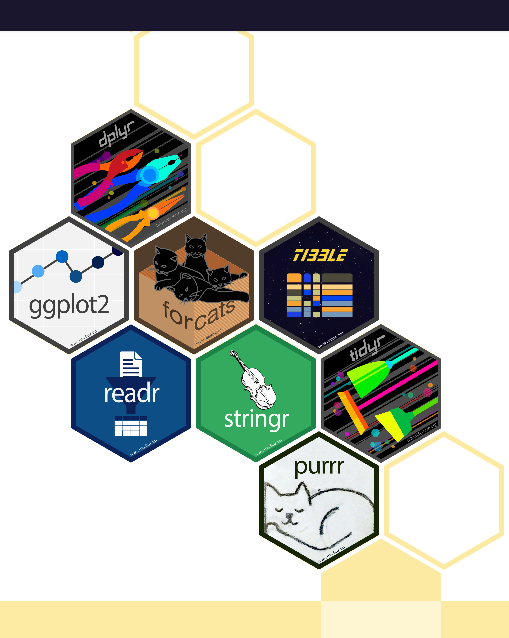{width="30%"}
:::
Collection de packages partageant une philosophie de conception, une grammaire et des structures de données sous-jacentes.  

C'est dans le tidyverse que l'on utilise le *pipe* `%>%`, qui permet de transférer une valeur dans une expression ou un appel de fonction.  

Exemple : `x %>% f`, plutôt que `f(x)`.

L'installation et l'utilisation du tidyverse complet se font en lançant les commandes :  
  
```{r installpkg, eval = FALSE, include = TRUE, echo = TRUE}
install.packages ("tidyverse")
library(tidyverse) 
```


## Les packages du tidyverse
### Les principaux packages du tidyverse 
  
| Package    | Détail                                  |
|:-----------|:----------------------------------------|
| dplyr      |manipulation des données                 |
| tidyr      |'rangement' des données                  |
| readr      |lecture des données                      |
| purrr      |programmation                            |
| tibble     |nouveau format de données                |
| stringr    |manipulation des chaînes de caractères   |
| forcats    |manipulation des facteurs                |
| ggplot     |création de graphiques                   |


## Les packages du tidyverse
D'autres packages, plus spécialisés doivent être chargés manuellement, avec la commande `library()` 

- Pour l'**import des données** :

| Package  | Détail                                     |
|:---------|:-------------------------------------------|
| DBI      | pour les bases de données relationnelles   |
| haven    | pour les données SPSS, Stata ou encore SAS |
| httr     | pour les API web                           |
| readxl   | pour les fichiers Excel (.xls ou .xlsx)    |
| rvest    | pour le *web scraping*                     |
| jsonlite | pour JSON                                  |
| xml2     | pour XML                                   |


## Les packages du tidyverse
- Pour la **manipulation des données** :

| Package   | Détail                               |
|:----------|:-------------------------------------|
| lubridate | pour les dates et les dates-heures   |
| hms       | pour les valeurs de l'heure du jour  |
| blob      | pour le stockage de données binaires |  


- Pour la **programmation** :

| Package   | Détail                               |
|:----------|:-------------------------------------|
| magrittr  | fournit le *pipe* `%>%`, et d'autres opérateurs (`%$%`, `%T>%` ou encore `%<>%`) |
| glue      | alternative à `paste()` pour combiner données ou chaînes de caractères           |


# Organiser son travail

## La reproductibilité
### 3 grands principes  

1. Organiser le travail
2. Coder pour les autres
3. Automatiser le plus possible

$\Rightarrow$ **pour avoir la capacité à reproduire, expliquer et partager les éléments clés utilisés dans le processus**  

Ces principes interagissent entre eux et sont non séquentiels  
  
## La reproductibilité 
### 1. Organiser le travail
- Structure de répertoires pour séparer données brutes, données créées, programmes, documentation et résultats
- Convention de dénomination des fichiers
- Ensemble clair des programmes et données
- Stratégie de différenciation fichiers mis à jour/anciens fichiers
- Comparaison facile des différentes versions du code
- Le cas échéant, organisation du partage des documents et programmes avec collègues/coauteurs/collaborateurs
- Conservation des idées et tests sont conservés et le cas échéant, des notes et conversations avec les collègues
- Mise en œuvre d'une procédure de sauvegarde


## La reproductibilité 
### 2. Coder pour les autres
- Noms des variables explicites
- Utilisation d'une convention pour les variables créées par rapport à celles d'origine
- Utilisation des chemins relatifs dans les programmes
- Possibilité d'exécuter le code sur un autre ordinateur
- Code est aussi générique que possible
- Code commenté
- Code compréhensible sans autre documentation


## La reproductibilité 
### 3. Automatiser le plus possible

- Code enregistré dans un format lisible  
- Le copier-coller est évité  
- Identification facile de l'ordre d'exécution des programmes  
- Le processus de création de chaque tableau, figure et résultat du document est facile à suivre  
- La ré-exécution de tous les programmes est facile  

Source : @Orozco2020

**Ces grands principes ne sont pas exclusifs à R, ils sont valables quel que soit le langage de programmation**  


## Nommer les objets
### Conventions pour nommer les objets  

- *allowercase* : tout en minuscule, sans séparateur  
- *period.separated* : tout en minuscule, mots séparés par des points  
- *underscore_separated* : tout en minuscule, mots séparés par un *underscore* (`_`)  
- *lowerCamelCase* : première lettre des mots en majuscule, à l'exception du premier mot ; et si nom simple, tout en minuscule  
- *UpperCamelCase* : première lettre des mots en majuscule, y compris le premier et même lorsque le nom est composé d'un seul mot   


**Point commun**  
Les noms des objets doivent débuter par une lettre et ne peuvent contenir que des lettres (non accentuées) ou des chiffres, des underscores (`_`) ou encore des points (`.`) mais les espaces sont bannis  

**Différence**  
La façon d'écrire les noms composés de plusieurs mots  

Possibilité de mixer les conventions, en gardant une cohérence dans la rédaction du code  


## Nommer les objets
### Recommandations  
Nommer les variables avec un nom : `temperature_max` par exemple  
Nommer les fonctions avec un verbe : `create.map` serait par exemple une fonction qui permettrait de créer une carte  

**Un guide pour aider à écrire les scripts de façon cohérente**  
*Tidyverse Style Guide*  
<https://style.tidyverse.org/index.html>

Il n'existe pas une et une seule façon d'utiliser R, chacun a sa propre pratique du logiciel.  

Néanmoins, il est conseillé d'adopter quelques “bonnes” pratiques pour un travail propre et efficace, en retenant les principes de la reproductibilité présentés précédemment


## Travailler avec des scripts et des projets sous RStudio
### Avantage  
Possibilité d'enregistrer l'ensemble du code, qui pourra ensuite être exécuté par bouts ou dans son intégralité  

### Conseils 

- commencer l'écriture du script par le chargement des packages utilisés dans ce script  
- bannir les chemins absolus, les remplacer par les chemins relatifs, plus facile à utiliser dans le cas de partages de scripts avec d'autres personnes  
- paramétrer RStudio de sorte qu'il n'enregistre pas l'espace de travail entre deux sessions  
- travailler par projet ; 1 projet d'analyse de données = 1 projet RStudio  


## Travailler avec des scripts et des projets sous RStudio
Un **projet** permet de conserver :  

- les fichiers de données,  
- les scripts R,  
- les résultats  
- les fichiers de sortie (données nettoyées, graphes, figures)   

dans un seul et même espace, et dans lequel il est possible de de créer des sous-répertoires  

$\Rightarrow$ **facilite la reproduction du travail**


## Travailler avec des scripts et des projets sous RStudio
### Créer un projet sous RStudio
À partir de l'icône dédiée en haut à droite de RStudio

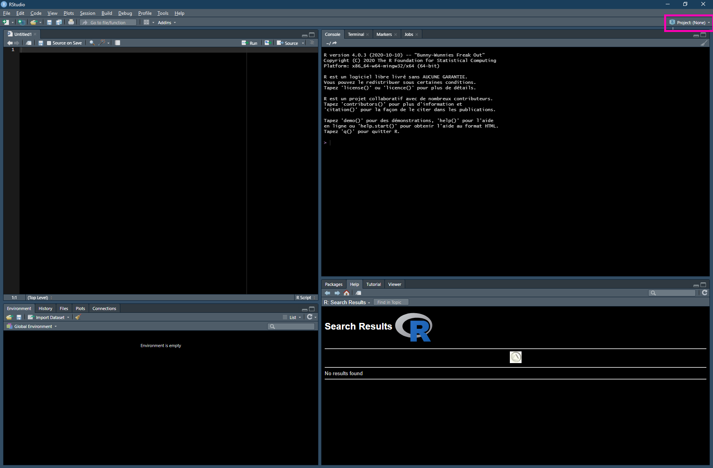{width="50%"}  


## Travailler avec des scripts et des projets sous RStudio
### Créer un projet sous RStudio
Sélectionner l'option "*New project*", puis l'option "*New Directory*" et enfin "*Empty Project*"  

{width="32%"} 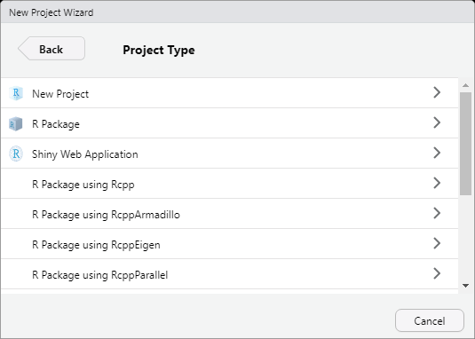{width="32%"} 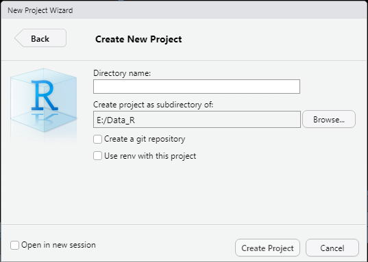{width="32%"}


## Travailler avec des scripts et des projets sous RStudio
### Organiser son projet RStudio
Il est recommandé d'organiser son projet, de le structurer en (sous-)dossiers pour ranger efficacement les différents documents liés à l'analyse.
Les dossiers :  

- **data** : pour les fichiers de données à importer sous R  
- **scripts** : pour les scripts
- **plot** : pour stocker les visualisations graphiques produites par les analyses  
- **img** : pour les images à insérer dans le rapport d'analyse (par exemple, le logo de l'institution)  

sont incontournables.  

**Il faut garder à l'esprit que ce qui est important ce sont les scripts et les fichiers de données initiales**

## Travailler avec des scripts et des projets sous RStudio
### Organiser son projet RStudio
**Exemples de structurations**  
(chacun s'organisera de la façon qu'il juge la plus adaptée à ses usages)  

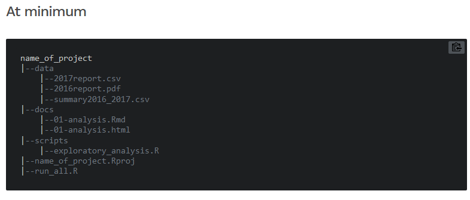{width="48%"} {width="48%"}

Source : <https://learn.r-journalism.com/en/publishing/workflow/r-projects/>  


## Travailler avec des scripts et des projets sous RStudio
### Exemple d'en-tête de script
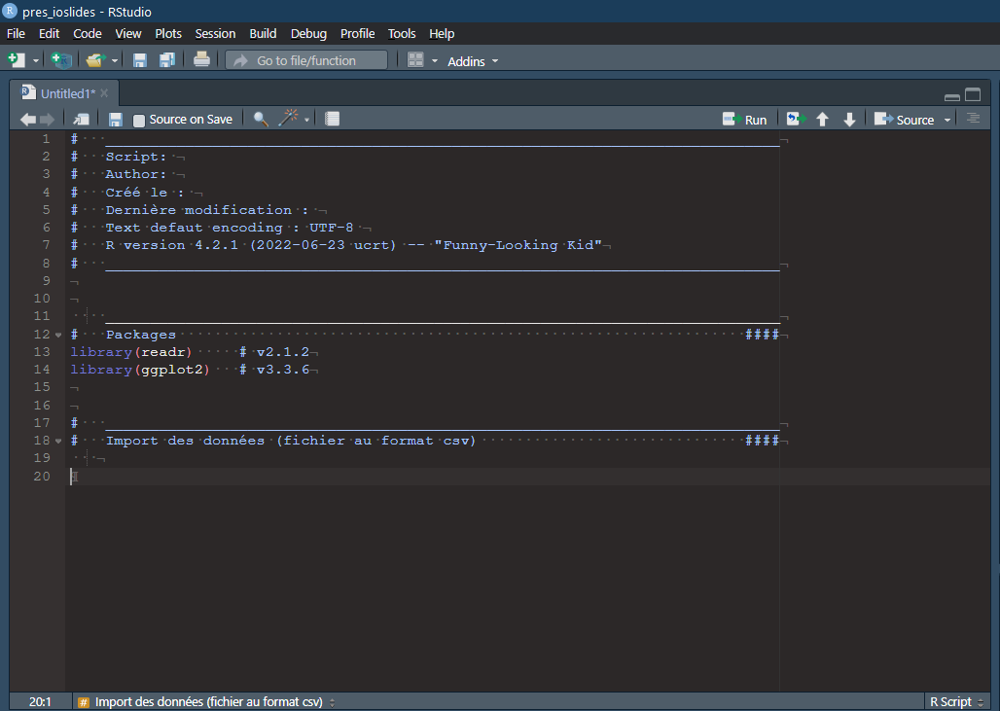{width=60%}


## Pour résumer  
### Les différentes étapes pour organiser son travail sous R

1.  Organiser son travail dans un projet RStudio  
2.  Organiser son projet RStudio  
3.  Utiliser le format RMarkdown pour écrire son analyse
4.  Organiser efficacement les données dans un tableur  
5.  Modifier les options par défaut de RStudio  
6.  Installer git pour versionner les scripts en RMarkdown
7.  Utiliser un outil de références bibliographiques

Pour une présentation détaillée de ces étapes, voir l'article en ligne [7 étapes pour organiser son travail sous R](https://statistique-et-logiciel-r.com/7-etapes-pour-organiser-son-travail-sous-r/) [@DellaVedova2019]


# Ressources

## Quel package pour quelle méthode ?
### Rappel
- Télécharger et installer un package : `install.packages("nom_du_package")`  
- Charger un package pour rendre les fonctionnalités de celui-ci disponibles : `library(nom_du_package)`  

La fonction `install.packages()` installe les packages depuis le dépôt <abbr title="Comprehensive R Archive Network" class="initialism">CRAN</abbr>.  

Il est possible d'installer d'autres packages, mis à disposition par d'autres utilisateurs sur leur répertoire [Github], grâce à la fonction `install_github()` du package devtools  (<https://github.com/hadley/devtools>). 

**Aucun package n'est plus important qu'un autre ; leur utilisation dépend de la tâche que l'on doit réaliser**  


## Quel package pour quelle méthode ?

La [liste complète des packages](http://cran.r-project.org/web/packages/) disponibles se trouve sur le site du CRAN

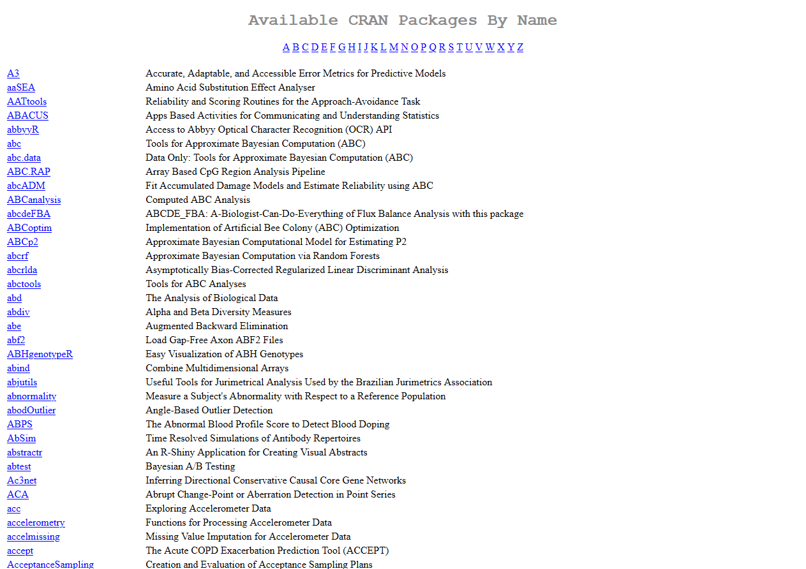{width="65%"}


## Quel package pour quelle méthode ?
Avec une répartition des packages par sujet d'intérêt disponible sur la page [Task Views](http://cran.r-project.org/web/views/) du CRAN.
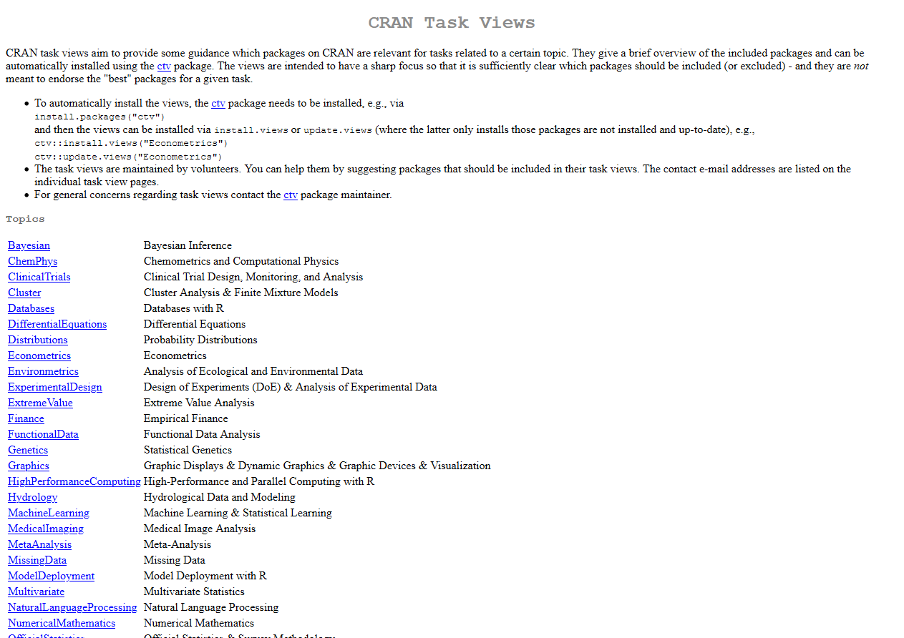{width="60%"}

Le site [Quick list of useful R packages](https://support.rstudio.com/hc/en-us/articles/201057987-Quick-list-of-useful-R-packages) recense quelques packages utiles


## Ressources en ligne
- Le site du [CRAN](http://cran.r-project.org) pour télécharger le logiciel et un accès à de nombreuses documentations, telles que 
[manuels](https://cran.r-project.org/manuals.html) ou autres [contributions](https://cran.r-project.org/other-docs.html)  
- Le site [R project](http://www.r-project.org/)  
- **Cheatsheets** : fiches synthétiques pour certains packages, disponibles sur le site de RStudio ([*cheatsheets*](https://rstudio.com/resources/cheatsheets/)) ou directement via la page d'accueil de la fenêtre d'aide de RStudio  
- Quelques exemples des nombreuses ressources disponibles en ligne : 
  - [R-bloggers](https://www.r-bloggers.com/)
  - le Slack [r-grrr](r-grrr.slack.com) 
  - la liste de ressources francophones [frrrenchies](https://github.com/frrrenchies/frrrenchies/)
  - le site [StackOverflow](http://stackoverflow.com/questions/tagged/r)
  - [Rzine](http://rzine.fr/), un site collaboratif et interdisciplinaire de référencement et de partage de documentation sur la pratique de R en sciences humaines et sociales  
  - un moteur de recherche, à partir de Google, nommé [Rseek](http://www.rseek.org/)   
- La revue en ligne [*R journal*](https://journal.r-project.org/)   
- La revue [*Journal of Statistical Software*](http://www.jstatsoft.org/) 


<!-- Recueil des données  -->
# Préparer les données

# Import de données

## L'import de données sous R en pratique
### Quels types de données peuvent être importés dans R ?
  
- Les données dans les formats "plats" ou formats délimités, comme le format csv ou txt  
- Les données issues d'Excel ou d'autres logiciels de statistique, comme Stata, SPSS ou SAS par exemple  
- Les données stockées dans une base de données relationnelle  

### Comment faire pour importer les données ?
Pas de solution unique, dépend du fichier à importer, à examiner, avec les questions suivantes :  

- La première ligne contient-elle le nom des variables ?  
- Quel est le caractère séparateur entre les différentes variables (= quel est le séparateur de champs) ?  
- Quel est le caractère utilisé pour indiquer les décimales, s'agit-il du point (à l'anglo-saxonne) ou de la virgule (à la française) ?  
- Les valeurs textuelles sont-elles encadrées par des guillemets et, si oui, s'agit-il de guillemets simples (’) ou de guillemets doubles (") ?  
- Y a-t-il des valeurs manquantes et si oui comment sont-elles indiquées (NA est parfois utilisé) ?  


## Format csv
`read.csv(file, header = TRUE, sep = ",", dec = ".")`

`readr::read_csv(file, col_names = TRUE)`

### Quelles différences entre ces 2 fonctions ?

|                             | `read.csv()`        | `read_csv()`            |
|:----------------------------|:--------------------|:------------------------|
|Objet en sortie              | *data.frame*        | *tibble*                |
|Traitement des caractères    | facteurs            | chaînes de caractères   |


Les fonctions `read.csv2()` et `readr::read_csv2()` considèrent par défaut que le séparateur est le point-virgule et que la virgule sert de séparateur décimal.


## Format txt
`read.table(file, header = TRUE, sep = "", dec = ".")`

`readr::read_table(file, col_names = TRUE)`

`read.delim(file, header = TRUE, sep = "\t", dec = ".")`

`readr::read_delim(file, delim = "\t", col_names = TRUE)`


## Format Excel
`xlsx::read.xlsx(file, sheetIndex, sheetName = NULL, startRow = NULL,  endRow = NULL, as.data.frame = TRUE, header = TRUE)`

`readxl::read_excel(file, sheet = NULL, skip = 0, col_names = TRUE)`


Il n'est pas possible d'importer plusieurs feuilles d'un classeur simultanément ; il faut donc préciser la feuille à importer en indiquant son nom ou sa position dans le classeur.


## Format issu d'un autre logiciel statistique 
**Import possible grâce** :  
- au package foreign, installé par défaut  
- au package haven, qui fait partie du tidyverse  
qui fournissent une fonction pour chaque type de fichier  

Les fichiers au format dBase (extension `.dbf`) peuvent également être importés avec la fonction `read.dbf()` du package foreign.  


## Récapitulatif - Import de données
| Type de fichier à importer | Base R                 | Tidyverse                                      | Séparateur de colonnes | Séparateur décimal |
|:---------------------------|:-----------------------|:-----------------------------------------------|:-----------------------|:-------------------|
| Délimité                   | `read.csv()`           | `readr::read_csv()`                            | `,`                    | `.`                |
|                            | `read.csv2()`          | `readr::read_csv2()`                           | `;`                    | `,`                |
|                            | `read.table()`         | `readr::read_table()`                          |                        | `.`                |
|                            | `read.delim()`         | `readr::read_delim()`                          | `\t`                   | `.`                |
|                            | `read.delim2()`        | `readr::read_delim2()`                         | `\t`                   | `,`                |
| Excel                      | `xlsx::read.xlsx()`    | `readxl::read_excel()`                         |                        |                    |
| SPSS                       | `foreign::read.spss()` | `haven::read_spss()` ou `haven::read_sav()`    |                        |                    |
| Stata                      | `foreign::read.dta()`  | `haven::read_stata()`                          |                        |                    |
| SAS                        | `foreign::read.ssd()`  | `haven::read_sas()`                            |                        |                    |
| dBase                      | `foreign::read.dbf()`  | \-                                             |                        |                    |

## Récapitulatif - Export de données

| Type de fichier souhaité | Base R                                     | Tidyverse                         |
|:-------------------------|:-------------------------------------------|:----------------------------------|
| .txt                     | `write.table()`                            | `readr::write_delim(delim = "\t")` |
| .csv                     | `write.csv()`                              | `readr::write_csv()`              |
| .xlsx                    | `xlsx::write.xlsx()`                       | \-                                |
| .dbf                     | `foreign::write.dbf()`                     | \-                                |
| .sav (SPSS)              | `foreign::write.foreign(package = "SPSS")` | `haven::write_sav()`              |
| .dta (Stata)             | `foreign::write.dta()`                     | `haven::write_dta()`              |


# Manipulation des données

## "Ranger" les données
**Les verbes de tidyr pour ranger les données :**

- `pivot_longer()` : transformer des colonnes en lignes
- `pivot_wider()` : transformer des lignes en colonnes (c'est la fonction inverse de `pivot_longer()`)
- `separate()` : séparer une colonne en plusieurs colonnes
- `separate_rows()` : séparer une colonne en plusieurs lignes
- `unite()` : regrouper plusieurs colonnes en une seule
- `extract()` : créer de nouvelles colonnes à partir d'une colonne de texte
- `complete()` : compléter des combinaisons de variables manquantes


## "Ranger" les données
### Le format "long"
**Format "long"** =  un jeu de données réduit à trois colonnes :  

(1) une colonne pour l'identifiant de l'observation  
(2) une colonne contenant le nom de la variable considérée  
(3) une colonne contenant la valeur  

**Comment passer du format "wide" au format "long" ?**  
`tidyr::pivot_longer(data, cols)    # dans cols, on liste les colonnes à faire pivoter vers le format long`

**Comment passer du format "long" au format "wide" ?**  
`tidyr::pivot_wider(data, names_from = name, values_from = value)`


## "Ranger" les données
### Séparer les colonnes ou les lignes avec `separate()` et `separate_rows()`
Lorsque plusieurs informations sont réunies dans une seule colonne, on peut les séparer avec la fonction `separate()`du package tidyr.

`tidyr::separate(data, col, into)`

Sur le même principe, la fonction `separate_rows()` va séparer plusieurs valeurs contenues dans une cellule pour les répartir dans plusieurs lignes

`tidyr::separate_rows(data, sep = "")`


## Transformer les données

Les manipulations de données rangées (sous forme de *data.frame* ou *tibble*) se font avec les verbes de dplyr.
Le résultat des manipulations est sous forme de *tibble*.

**Les verbes de dplyr pour manipuler les données :**

- `slice()` : sélectionne les lignes selon leur position
- `filter()` : filtre (sous-ensemble) de lignes
- `select()` : sélection de colonnes (variables)
- `rename()` : renommer des colonnes
- `relocate()` : réordonner des colonnes
- `arrange()` : trier les observations selon une ou plusieurs colonnes
- `mutate()` : créer de nouvelles variables en fonction d'autres variables


<!-- Restitution -->
# Restitution

# Fonctions pour une exploration automatisée des données

##
* Fonction `summary()`
Utile pour avoir une vue résumée d'une variable  
S'applique à tout type d'objet, y compris un *data.frame* entier, et s'adapte à celui-ci  

* Fonction `glimpse()`
**Permet de visualiser de manière condensée le contenu d'un tableau de données** - package dplyr 

* Fonction `describe()`
**Décrit également les différentes variables d'un tableau de données** - package questionr  

* Fonction `tbl_summary()`
**Calcul des statistiques descriptives pour les variables quantitatives et qualitatives** - package gtsummary  

* Fonction `dfSummary()`
**Présentation des résultats dans un tableau, pour variables QN & QL** - package summarytools  

## Des rapports préformatés
### Fonctions pour mettre les statistiques descriptives dans un rapport préformaté  

- `create_report()` du package DataExplorer  
  - rapport automatique, au format HTML
  - visualisations graphiques (distributions, analyses de corrélations, ACP)
  - état des lieux du jeu de données, concernant notamment le type des variables ou les données manquantes  
- `makeCodebook()` du package dataMaid  
  - présentation de l'ensemble des variables du jeu de données, au format PDF, Word ou HTML (créé un fichier au format Rmarkdown)  

$\Rightarrow$ utilité pour première exploration des données  


# Graphiques avec ggplot2 

## Représentations graphiques sous R
### Plusieurs systèmes graphiques pour représenter les données

- *Base graphics* : le plus simple à apprendre
- *Grid graphics* : ensemble de modules puissants pour construire d'autres outils
- *Lattice graphics* : système à caractère général basé sur Grid ; logique *trellis graphics* (Cleveland)
- *ggplot2* : basé sur "*grammar of graphics*" $\Rightarrow$ graphiques composés de différentes couches d'éléments grammaticaux et qui respectent des règles mathématiques et esthétiques


**Le package ggplot2 est un package du tidyverse qui procède en 2 étapes**  

1. initialisation du graphique, grâce aux fonctions `qplot()` ou `ggplot()`
2. ajout de couches ( calques), chaque élément s'ajoutant à l'autre grâce au signe `+`


## Le package ggplot2
### Les principales couches
::: {.img-left}
{width="25%"}
:::

- couche "**data**" : données à afficher
- couche "**aesthetics**"  : variables à représenter
- couche "**geometries**" : formes utilisées pour représenter les données
- couche "**facets**" : tableau de graphes
- couche "**statistics**" : modèles ou transformations statistiques des données
- couche "**coordinates**" : espace de représentation (horizontal, vertical, etc.)
- couche "**theme**" : arrière-plan


## Le package ggplot2
### Les couches additionnelles
- couche "**scale**" : échelle des axes (linéaire, logarithmique, etc.), couleurs de remplissage
- couche "**ggtitle**" : titre principal du graphique
- couche "**xlab**" : libellé des abscisses
- couche "**ylab**" : libellé des ordonnées
- couche "**labs**" : titre principal, libellé des abscisses, libellé des ordonnées en une seule fonction


## Le package ggplot2
### Couche *data & aes*
**Les graphiques construits avec ggplot2 commencent toujours par**  

- une ligne de code qui initialise le graphique (`ggplot()`),
- puis les données sur lesquelles s'appuient toutes les couches qui suivront (`data()`)
- et les variables à représenter (`aes()`)

On peut donc construire les graphiques en suivant le format :
`ggplot(data, aes(x = X, y = Y, colour = col, fill = fill, size = size))`

À ce stade, on créé le canevas du graphique, mais les données ne sont pas encore représentées


## Le package ggplot2
### Couche *data & aes*
**Modification de l'esthétique grâce aux éléments suivants**  

|*Aesthetic* | Description                               |
|:-----------|:------------------------------------------|
| x, y       | axe des abscisses et des ordonnées        |
| colour     | couleurs des points, lignes, etc.         |
| fill       | couleur de remplissage                    |
| size       | taille des points, épaisseur des lignes   |
| alpha      | transparence                              |
| linetype   | motif des tirets des lignes               |
| labels     | texte du graphique ou des axes            |
| shape      | type de formes                            |


## Le package ggplot2
#### Rappel : les symboles de points sous R
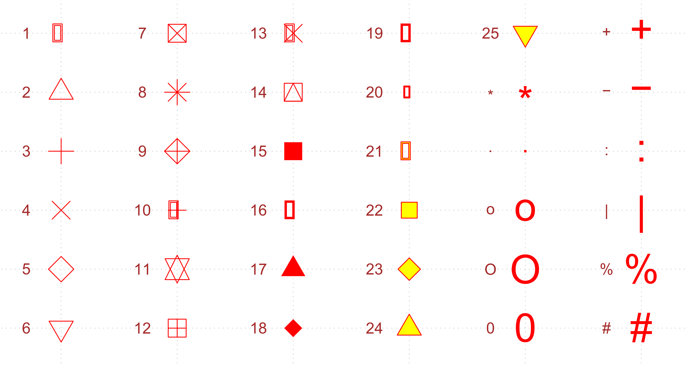{width="85%"}


## Le package ggplot2
### Couche *geom*
On déclare ensuite la géométrie
= couche qui correspond aux éléments pour représenter les données

On détermine le type de graphique souhaité, en utilisant les fonctions préfixées par `geom_`

On peut représenter plusieurs couches *geom* sur un même graphique, elles s'ajoutent avec l'opérateur `+`

Les données sont à présent ajoutées sur le graphique

## Le package ggplot2
### Couche *geom*
Les couches les plus courantes sont :

- `geom_bar()` : graphique en barres (équivalent de la fonction `barplot()`)
- `geom_histogram()` : histogramme (équivalent de la fonction `hist()`)
- `geom_point()` : nuage de points (équivalent de `plot()`)
- `geom_line()` : points reliés par un segment
- `geom_boxplot()` : boîte à moustaches
- `geom_text()` : afficher des étiquettes de texte (en précisant la position des étiquettes avec x et y et le label pour le texte)
- `geom_label()` : identique à `geom_text()`, avec un rendu différent

L'ensemble des géométries est détaillé dans la partie "Geoms" de la *cheatsheet* du package ggplot


## Le package ggplot2
### Couche *facet*
Permet d'effectuer plusieurs fois le même graphique selon les valeurs d'une ou plusieurs variables qualitatives
$\Rightarrow$ séparer la fenêtre graphique selon un facteur, selon 2 possibilités :

- `facet_wrap` : affiche les graphiques les uns à côté des autres avec une répartition automatique dans la page
- `facet_grid` : les graphiques sont disposés selon une grille

### Couche *stat*
Permet d'ajouter des indicateurs statistiques au graphique

### Couche *coord*
La couche *coord* permet de choisir le système de coordonnées sans lequel sont projetées les données, qui par défaut est le système cartésien.
Cette couche est moins couramment utilisée.


## Le package ggplot2
### Le thème
Permet de personnaliser tous les éléments visuels des graphiques qui ne sont pas reliés aux données : titres, tailles des axes, légende, grilles, couleur de fond, etc.

Plusieurs thèmes prédéfinis sont disponibles dans le package ggplot2 :

- `theme_gray()` : couleur de fond gris et lignes de grille blanches. Utile pour mettre en avant les données pour faciliter les comparaisons
- `theme_bw()` : fond blanc et lignes de grille grises
- `theme_linedraw()` : traits noirs avec différentes largeurs sur fond blanc, rappelant un dessin au trait
- `theme_light()` : similaire à `theme_linedraw()` mais avec des lignes et des axes gris clair
- `theme_dark()` : identique à `theme_light()` mais avec un fond sombre
- `theme_minimal()` : aucune annotation d'arrière-plan
- `theme_classic()` : des lignes sur les axes x et y et pas de lignes de grille
- `theme_void()` : thème complètement vide


## Le package ggplot2
### Le thème
Les thèmes prédéfinis
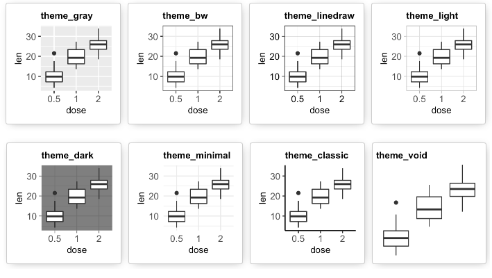


## Le package ggplot2
### Couche *scale*
Pour modifier les attributs graphiques liés aux axes (échelles, limites, format des chiffres par exemple) et aux données représentées (couleurs, etc.)

### Autre personnalisation du graphique
Possibilité d'ajouter un titre au graphique ou encore de modifier l'intitulé des axes des abscisses et des ordonnées

Il existe une solution clique-bouton, idéale lors des phases exploratoires, c'est la fonction `esquisser()` du package esquisse


## Quelques conseils généraux pour la réalisation des graphiques
- "Le moins est le mieux" $\Rightarrow$ pour le rendre plus compréhensible, il est préférable d'épurer le graphique et de retirer la 3D
- Les objets proches sont perçus comme appartenant à un même groupe $\Rightarrow$ positionner côte à côte les éléments que l'on souhaite voir analysés ensemble, comparés l'un à l'autre
- Certains éléments peuvent être omis sans réduire la compréhension (axe des abscisses selon les cas)
- Il n'est pas nécessaire de "fermer" les graphiques avec un cadre, ce qui permet d'alléger les visualisations
- Dans un diagramme en barre, l'axe des ordonnées commence à 0

**Aide pour construire un graphiques. Galerie des différents graphiques possibles avec scripts associés**  

- <https://r-graph-gallery.com/>
- <https://r-charts.com/>

## Quelques conseils généraux pour la réalisation des graphiques
**Outils pratiques pour aider dans le choix des couleurs**  

  - informations sur une couleur <https://chir.ag/projects/name-that-color/>
  - un générateur de palettes de couleurs <https://coolors.co/>
  - palettes de couleurs prédéfinies <https://flatuicolors.com/>
  - palettes de couleurs pour la cartographie <http://colorbrewer2.org>

**Site utile pour se souvenir des bonnes pratiques de *datavisualisation***  

- From Data to Viz <https://www.data-to-viz.com>


## Exporter les graphiques obtenus
**Enregistrer un graphique créé avec RStudio (qui s'affiche dans l'onglet 'Plots')** 

Cliquer sur 'Export' qui donne accès à trois options différentes :

- save as image
- save as PDF
- copy to clipboard

Il est également possible d'utiliser les fonctions `jpeg()`, `png()`, `bmp()` ou `tiff()` du package grDevices pour enregistrer un graphique au format 'image', sans passer par l'onglet 'Plots'

`png(filename = "fichier.png")`
`ggplot(...)`
`dev.off()`

Dans ce package, il existe également la fonction `pdf()` qui permet d'enregistrer les graphiques dans ce format


# Rapport avec RMarkdown 

## Une introduction
### Reporting  
= créer un document, qui mêle texte et code, décrivant clairement et de manière compréhensible la méthode employée et/ou les résultats des analyses $\Rightarrow$ penser à vulgariser le proposer et à proposer des visualisations  

Sous RStudio : package RMarkdown pour générer des documents au format HTML, PDF, Word entre autres  
Outil pratique pour l'exportation, la communication et la diffusion de résultats  


## Une introduction
**Création rapide d'un rapport de résultats à partir d'un script R**

Si votre script contient toutes les informations nécessaires pour réaliser les analyses, en particulier, le chargement des données et les packages utilisés, en plus des lignes de code spécifiques au traitement et à l'analyse, il est possible de réaliser très facilement un rapport format HTML, Word ou PDF, qui contient à la fois le code et les sorties associées.  

Il existe en effet dans le menu *File* de RStudio, une option *Compile report*, qui va produire directement un rapport à partir d'un script R.

Il est également possible de créer le document avec la commande suivante :
`rmarkdown::render("monfichierdanalyse.R")`

## Comment construire un document RMarkdown ? 
Nécessite le package RMarkdown, mais aussi markdown et knitr  

Sous RStudio, création d'un nouveau document avec le menu *File* / *New file* / *R Markdown*, ce qui affiche la boîte de dialogue suivante :  

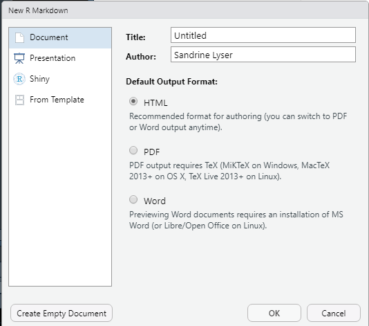{width="40%"}

## Comment construire un document RMarkdown ? 
Cela créé un fichier avec l'extension `.Rmd`, autrement dit un fichier texte au format RMarkdown  

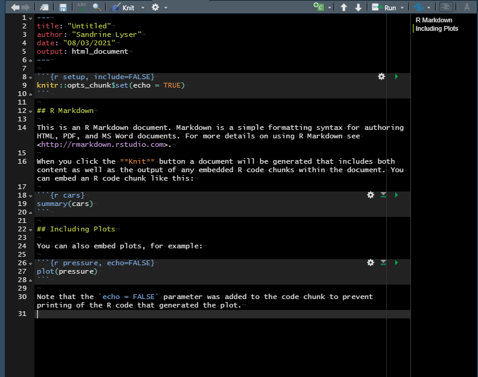{width="50%"}

Compilation possible à tout moment, pour obtenir et visualiser le document généré : en cliquant sur le bouton *Knit* et en choisissant le format de sortie voulu  


## Comment construire un document RMarkdown ? 
Pour pouvoir générer un document au format PDF, il faut avoir une installation LaTeX sur l'ordinateur.  
Si ce n'est pas le cas, il est possible d'installer une distribution LaTeX minimale, grâce au package tinytex, en exécutant les commandes suivantes : 
```{r tinytex, eval = FALSE, include = TRUE, echo = TRUE, message = FALSE, warning = FALSE}
install.packages("tinytex")
tinytex::install_tinytex() 
```


## Les différents éléments d'un document RMarkdown 
### En-tête
Délimité par trois tirets (`---`), placés au début et à la fin de cette première partie  
Permet de définir les métadonnées du document (titre, auteur, date) et options de configuration et personnalisation

```{r rmarkdownyaml, eval = FALSE, include = TRUE, echo = TRUE, message = FALSE, warning = FALSE}
---
title: "Titre"
author: "Prénom Nom"
date: "10 avril 2017"
output: html_document
---
```


## Les différents éléments d'un document RMarkdown 
### Texte du document
Texte avec syntaxe markdown  

- pour définition des niveaux de titre : la ligne commence avec un ou plusieurs signes `#`  
- mise en forme du texte
  + en *italique* : mots placés entre astérisques (`*un texte en italique*`) ou entre *underscores* (`_un deuxième texte en italique_`)
  + en **gras** : mots placés entre une paire d'astérisques (`**un texte en gras**`)
  + en **_gras-italique_** : en combinant les deux syntaxes (`**_un texte en gras et italique_**`)
- des listes à puces : lignes commençant par un tiret (`-`) pour le premier niveau et un `+` pour le deuxième niveau
- insérer des liens : `[Exemple de lien](https://example.com)`  


## Les différents éléments d'un document RMarkdown 
### Texte du document
- insérer des images : `` 

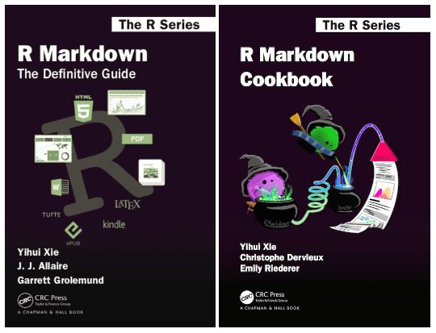{width=38%}


## Les différents éléments d'un document RMarkdown 
### Texte du document
Pour créer un tableau, il faut 

- une ligne d'en-tête avec le nom des colonnes
- une ligne de tirets (`-`) placée sous la ligne d'en-tête
- les lignes de valeurs

en séparant à chaque fois les colonnes par des barres verticales `|`

L'alignement dans les cellules est précisé avec le signe `:`


## Les différents éléments d'un document RMarkdown  
**Exemple**  

Le code ci-dessous

`| Colonne 1  | Colonne 2 | Colonne 3||`  
`| :--------- |:---------:| --------:|`  
`| Aligné à gauche  |   ce texte   |  Aligné à droite |`  
`| Aligné à gauche  | est    |   Aligné à droite |`  
`| Aligné à gauche  | est    |   Aligné à droite |`  

Donne le résultat  

| Colonne 1  | Colonne 2 | Colonne 3|
| :--------- |:---------:| --------:|
| Aligné à gauche  |   ce texte   |  Aligné à droite |
| Aligné à gauche  | est    |   Aligné à droite |
| Aligné à gauche  | centré |   Aligné à droite |


## Les différents éléments d'un document RMarkdown 
### Tableaux
Possibilité d'améliorer leur présentation  

- fonction `kable()` du package knitr 
- fonction `flextable()` du package flextable  


### Blocs de code R
Code R écrit dans le script, à l'intérieur de *chunks*, qui sont délimités par la syntaxe suivante  

` ```{r nomduchunk, echo = TRUE, eval = TRUE, include = TRUE, warning = FALSE, message = FALSE, fig.width = 3, fig.height = 3}`  
`x <- c(1, 2, 3, 4)`  
`plot(x)`  
` ``` `  
Les sorties des fonctions statistiques sont affichées comme dans la console  


## Les différents éléments d'un document RMarkdown 
### Blocs de code R
Ce qui produit le résultat  
```{r nomduchunk, echo = TRUE, eval = TRUE, include = TRUE, warning = FALSE, message = FALSE, fig.width = 3, fig.height = 3}
x <- c(1, 2, 3, 4)
plot(x)
```

## Les différents éléments d'un document RMarkdown 
### Blocs de code R
Le comportement des *chunks* peut être personnalisé  

- on peut donner un nom, qui devra être différent pour chaque *chunk.* Il s'écrit après le `r` ;  
- l'option *echo* permet au *chunk* d'être inséré dans le document généré, avec soit le code et le résultat (option `TRUE`), soit en cachant le code (option `FALSE`), qui est malgré tout exécuté ;  
- l'option *eval* : exécuter le code R à la compilation du document ;  
- l'option *include* : inclure le code et les résultats ;  
- l'option *warning* : afficher les avertissements générés par le *chunk* dans le document fini ;  
- l'option *message* : afficher les messages générés par le *chunk* dans le document fini ;  
- l'option *results* : type/format de résultats renvoyés par le *chunk* ;  
- des options sont possibles pour l'affichage des graphiques générés par le *chunk*.  


## Les différents éléments d'un document RMarkdown
### Blocs de code R
Les commandes écrites à l'intérieur des *chunks* peuvent être directement exécutées sous R, comme n'importe quel code  

Dans RStudio, les résultats d'un *chunk* (texte, tableau ou graphique) s'affichent directement dans la fenêtre du document, ce qui facilite la visualisation  

Le *chunk* de *setup*, qui permet de régler les options par défaut de tous les *chunks* doit se trouver juste après l'en-tête. 

`{r setup, include = FALSE, message = FALSE, warning = FALSE}`
`knitr::opts_chunk$set(echo = TRUE)`

Ainsi, avec ce paramétrage, les messages et avertissements ne seront jamais affichés (sauf mention contraire dans l'accolade d'un *chunk* spécifique)  


## Les différents éléments d'un document RMarkdown 
### Personnaliser le document généré
Les options en en-tête du document permettent de personnaliser le document  

Possibilité de le faire grâce à une interface graphique sous RStudio   
icône en forme d'engrenage situé à droite du bouton *Knit*, en choisissant le menu '*Output options*'   

Les modifications effectuées via l'interface graphique sont automatiquement répercutées dans l'en-tête du document  

Possibilité de créer des documents  

- qui répondent à des mises en page particulières (*templates*), 
- sous forme de présentations (de type powerpoint), sites web, livres, applications interactives  
  
en choisissant le format souhaité dans la fenêtre de création d'un nouveau document  

**Galerie des différentes sorties possibles**   <https://rmarkdown.rstudio.com/gallery.html>  


## Pour aller plus loin...

Le site de RMarkdown  
<https://rmarkdown.rstudio.com/>  

Documents utiles pour aider à la rédaction de documents RMarkdown  

- R Markdown Cheat Sheet  <https://raw.githubusercontent.com/rstudio/cheatsheets/main/rmarkdown.pdf>  
- R Markdown Reference Guide  <https://www.rstudio.com/wp-content/uploads/2015/03/rmarkdown-reference.pdf> 
- Les manuels spécifiques, disponibles en ligne  
  + R Markdown: The Definitive Guide  
  <https://bookdown.org/yihui/rmarkdown/>  
  + R Markdown Cookbook  
  <https://bookdown.org/yihui/rmarkdown-cookbook/>  


<!-- Bibliographie  -->
# Bibliographie 

## Références citées

